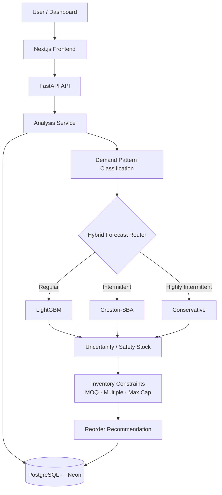
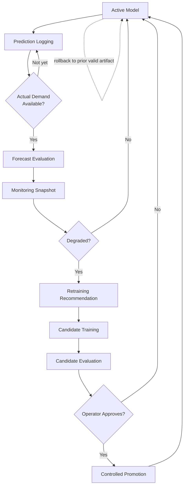

# SupplySync AI

[](https://github.com/Samarth7194/supplysync-ai/actions/workflows/test.yml)


**ML-powered inventory decision support with hybrid demand forecasting and a controlled MLOps lifecycle.**

SupplySync AI is a full-stack ML inventory decision-support prototype that classifies each SKU's demand pattern, routes it to an appropriate forecasting strategy (LightGBM, Croston-SBA, or a conservative buffer), quantifies forecast uncertainty, and converts the forecast into a constrained reorder recommendation. Beyond the forecast-to-decision path, it manages the model's own lifecycle — logging predictions, evaluating them once real outcomes exist, monitoring for performance degradation, recommending retraining, training and evaluating candidate models, and promoting or rolling back the serving artifact under explicit human control.

The deployed demo runs on a historical retail transaction dataset — there is no live ERP/POS feed. That constraint is treated as a design input rather than hidden: see [Model Monitoring & Historical Replay](#model-monitoring--historical-replay) for how the project still demonstrates a real monitoring lifecycle without fabricating data.

**Docs:** [Architecture](docs/architecture.md) · [Database Design](docs/database-design.md) · [MLOps Monitoring](docs/mlops-monitoring.md) · [MLOps Operations](docs/mlops-operations.md) · [Model Promotion](docs/model-promotion.md) · [API Reference](docs/api.md) · [Guided Tour](docs/PROJECT_GUIDED_TOUR.md) · [Project Explained](docs/PROJECT_EXPLAINED.md)

**Portfolio:** [Resume Entry](docs/portfolio/RESUME_PROJECT_ENTRY.md) · [Interview Guide](docs/portfolio/INTERVIEW_GUIDE.md) · [Project Summary](docs/portfolio/PROJECT_SUMMARY.md)

---

## Highlights

- **~4,900 SKUs**, **531K+ daily-demand records** (2009-12-01 → 2011-12-09) from the UCI Online Retail II dataset
- **Hybrid forecasting** — regular demand → LightGBM (15-feature schema); intermittent → Croston-SBA; highly intermittent → a conservative buffer
- **Uncertainty-aware safety stock** — rolling residual sigma when evidence exists, Z-score × σ × √lead-time otherwise
- **Controlled MLOps lifecycle** — prediction logging → evaluation → monitoring → degradation detection → retraining recommendation → candidate training/evaluation → human-approved promotion → rollback, with a full audit trail
- **Historical Monitoring Replay** — demonstrates the monitoring pipeline honestly against held-out historical data instead of fabricating live telemetry
- **280 backend tests** (pytest) + **30 frontend tests** (typecheck + lint clean) + PostgreSQL integration tests, all in CI
- **Deployed full-stack**: Next.js on Vercel, FastAPI on Render, PostgreSQL on Neon

---

## Production Deployment

| Surface | Provider | Notes |
|---|---|---|
| Frontend | Vercel | Next.js 16 App Router |
| Backend API | Render | https://supplysync-ai.onrender.com |
| Database | Neon PostgreSQL | Alembic-managed schema, single migration head |
| Model runtime | Resolved at startup | DB-active artifact → configured local artifact → statistical fallback (see [Model Promotion](docs/model-promotion.md)) |

Free-tier hosting may cold-start after inactivity. Runtime model/data artifacts (the trained `.pkl` and processed parquet) are intentionally not committed to Git — only portable metadata is.

---

## How It Works

1. Load the SKU's recorded demand history (or accept caller-supplied history, or fall back to a clearly-labeled synthetic series for unknown SKUs).
2. Classify the demand pattern — regular, intermittent, or highly intermittent — from its zero-demand share.
3. Route to the forecasting method suited to that pattern.
4. Produce a multi-day horizon forecast.
5. Estimate forecast uncertainty from rolling residuals (or a historical fallback).
6. Compute lead-time demand, safety stock, and the reorder point.
7. Apply supplier constraints — MOQ, order multiple, maximum order cap.
8. Persist the recommendation and a linked prediction-log row as evaluation evidence.
9. Once a forecast's target window has actually passed, evaluate it against real recorded demand.
10. Roll evaluated forecasts into a monitoring snapshot that classifies recent performance as stable, warning, or degraded.

---

## Architecture



SKU history flows in from the processed dataset (or the caller), gets classified, routed to one of three forecasting methods, turned into an uncertainty-adjusted safety stock and reorder point, constrained by supplier rules, and returned alongside a persisted audit trail in PostgreSQL.

### Demand → forecast method

| Demand Pattern | Forecast Method | Why |
|---|---|---|
| Regular | **LightGBM** | Enough non-zero signal to learn lag/rolling/calendar relationships |
| Intermittent | **Croston-SBA** | Designed for sparse, non-zero demand; avoids the bias plain averaging introduces on gaps |
| Highly intermittent | **Conservative buffer** | Too little signal for ML to be trustworthy — a bounded buffer avoids overconfident forecasts |

### From forecast to reorder decision

```
lead_time_demand = sum(forecast over lead time)
safety_stock     = Z(service_level) × forecast-error σ × √(lead time)      [or dynamic, from rolling residuals]
reorder_point    = lead_time_demand + safety_stock
raw_order        = max(0, reorder_point − current_stock)
final_order      = raw_order, rounded up to MOQ → order multiple → capped at max order
```

The system produces a **recommendation** — it does not place purchase orders automatically.

---

## Model Monitoring & Historical Replay

Live monitoring needs new predictions **and** the real demand that later arrives for them. The demo's dataset is historical and frozen at 2011-12-09, and the project has no live ERP/POS feed connected — so predictions logged against "today" target windows that extend past the dataset's end and can never receive genuine new actuals. Rather than fabricate demand to make the monitoring card look populated, live monitoring is left honestly `insufficient_evidence`/`unavailable` in that state, and a second mechanism — **Historical Monitoring Replay** — demonstrates the same monitoring lifecycle against data that already exists:

1. Pick an anchor date **T** inside the dataset, well before its end.
2. Forecast using only demand recorded on or before **T** (no future data enters feature generation — this is tested explicitly).
3. Compare that forecast against the real, already-recorded demand for **T+1 … T+H**.
4. Compute the same WAPE/MAE/RMSE/Bias/MASE metrics and the same stable/warning/degraded classification live monitoring uses.
5. Label every result `historical_replay` — never presented as live evidence, and structurally unable to trigger retraining, candidate training, or promotion.

The frontend shows this with a highly visible **HISTORICAL REPLAY** badge and the sentence *"This is not live production monitoring."*

**Most recent replay example** (`GET /api/model-monitoring/replay`):

| | |
|---|---|
| Historical period | 2011-11-19 → 2011-12-09 |
| Horizon | 7 days |
| LightGBM-scoped evaluations (latest window) | 39 |
| Unique SKUs across replay | 59 |
| Replay WAPE | ~1.25 |
| Matched 7-day offline baseline WAPE | ~1.07 |
| Status | **Warning** — recent WAPE ~17.4% worse than the matched baseline |

| Method (all replayed windows) | SKUs | WAPE |
|---|---:|---:|
| LightGBM | 47 | ~1.14 |
| Croston-SBA | 11 | ~0.79 |
| Conservative | 1 | ~4.06 |

These three method rows come from **different SKU populations** selected by the router (regular vs. intermittent vs. highly-intermittent demand) — not a controlled head-to-head benchmark on the same SKUs. See [docs/mlops-monitoring.md](docs/mlops-monitoring.md) for the full design and the three-way distinction below.

### Three evidence concepts — do not confuse them

| | Used for | Source |
|---|---|---|
| **Offline Backtest** | Model comparison, inventory KPI simulation | `scripts/evaluate_forecast.py`, one-step-ahead temporal holdout |
| **Historical Monitoring Replay** | Demonstrating the monitoring lifecycle end-to-end | Held-out historical windows, described above |
| **Live Production Monitoring** | Real production forecast-performance tracking | Requires new predictions **and** subsequently-arriving real demand — not currently connected |

---

## MLOps Lifecycle



**Implemented:** prediction logging, temporally-safe forecast evaluation (WAPE/MAE/RMSE/Bias/MASE), rolling monitoring snapshots, WAPE/bias degradation detection, retraining recommendations, candidate model training and evaluation, a checksum- and feature-schema-validated artifact registry, model lifecycle states, controlled promotion with an evidence gate, rollback to any prior valid artifact, a full promotion/rollback audit trail, DB-active runtime model resolution, and a safe operational cycle script that evaluates/monitors/recommends without ever training or promoting on its own.

**`AUTO_RETRAIN_ENABLED=false` and automatic promotion are both intentionally disabled.** The system can *recommend* retraining and can *evaluate* a candidate as promotion-eligible — it never trains or promotes anything by itself. A human runs the promotion or rollback CLI explicitly, and every such action is validated (checksum, feature schema, deserialization) before it changes the database's lifecycle state, and recorded to an audit table either way. See [docs/model-promotion.md](docs/model-promotion.md).

---

## Evaluation

**Offline backtest** (`scripts/evaluate_forecast.py`, 20 SKUs, 600 test points, 30-day temporal holdout):

| Model | MAE | RMSE | Bias | WAPE | MASE |
|---|---:|---:|---:|---:|---:|
| naive_last | 109.92 | 175.12 | 5.82 | 1.19 | 0.97 |
| seasonal_naive_7 | 92.80 | 166.21 | 5.59 | 1.00 | 0.82 |
| moving_avg_7 | 86.40 | 129.38 | 2.25 | 0.93 | 0.76 |
| **croston_sba** | **80.41** | **125.88** | −1.46 | **0.87** | **0.71** |
| lightgbm | 91.67 | 143.58 | 26.06 | 0.99 | 0.83 |

Sparse, intermittent retail demand is genuinely hard to forecast — a WAPE near or above 1.0 is common on this kind of data, not a sign of a broken model. Croston-SBA beats LightGBM in aggregate here, and that's the *reason the hybrid architecture exists*: on intermittent SKUs, LightGBM's bias turns strongly positive (systematic over-forecasting), so the live router never sends intermittent or highly-intermittent SKUs through it. No single method dominates every demand pattern on real retail data, so the system doesn't pretend one does — it evaluates evidence per pattern and routes accordingly. Full per-class breakdown in [docs/forecast-error-analysis.md](docs/forecast-error-analysis.md).

**Historical Monitoring Replay** (7-day horizon, held-out historical windows) is summarized above — it exercises the live routing/forecasting code, not the offline backtest's one-step-ahead methodology, so its numbers are not directly comparable to the table above even though both report WAPE.

Reproduce the offline backtest:
```bash
cd backend && python scripts/evaluate_forecast.py
```

---

## Screenshots

No screenshots are committed yet — this repository does not fabricate images. Follow [`docs/screenshots/README.md`](docs/screenshots/README.md) for the exact capture list (dashboard, SKU detail, Model Health / Historical Replay card, hybrid method performance breakdown) and drop the PNGs into `docs/screenshots/` using the filenames given there; this section will link them once they exist.

---

## Repository Structure

```
backend/
  src/         # services, repositories, forecasting, inventory, evaluation, MLOps logic
  scripts/     # operator CLIs — train, evaluate, promote, rollback, monitor, replay
  tests/       # 280+ pytest cases
  data/        # cached KPIs, offline evaluation artifacts, historical replay output
frontend/
  app/         # Next.js App Router pages
  components/  # dashboard + Model Health / Historical Replay UI
  lib/         # typed API client, formatting helpers
  tests/       # node test runner + typecheck + lint
docs/
  architecture.md, database-design.md, mlops-monitoring.md,
  mlops-operations.md, model-promotion.md, api.md, portfolio/
```

---

## Local Setup

### Prerequisites
- Python 3.11+ (CI runs 3.12)
- Node.js 20+
- ~500 MB disk for the raw CSV + processed parquet + trained model

### 1. Get the dataset
Download `online_retail_II.csv` from [UCI](https://archive.ics.uci.edu/dataset/502/online+retail+ii) and place it at `data/raw/online_retail_II.csv` (not committed to the repo).

### 2. Backend
```bash
cd backend
python -m venv .venv && source .venv/bin/activate   # Windows: .venv\Scripts\activate
pip install -r requirements.txt

python scripts/check_setup.py     # shows what's present vs. missing
python scripts/bootstrap.py       # trains LightGBM, builds the parquet, computes KPIs (idempotent)

python -m alembic upgrade head    # applies the PostgreSQL schema (safe on SQLite too, for local dev)
python -m pytest tests/ -q        # 280 passed, 8 skipped

uvicorn main:app --reload --port 8000
```

### 3. Frontend
```bash
cd frontend
npm install
cp .env.example .env.local   # set NEXT_PUBLIC_API_URL if not http://localhost:8000
npm run dev                  # http://localhost:3000
```

### Docker (optional)
```bash
cd backend && python scripts/bootstrap.py && cd ..   # generate artifacts on the host first
docker-compose up --build
```

---

## Environment Variables

**Backend** (see `backend/.env.example` for the full list):

| Variable | Default | Purpose |
|---|---|---|
| `DATABASE_URL` | `sqlite:///backend/data/supplysync.db` | SQLAlchemy database URL — use PostgreSQL in Docker/production |
| `MODEL_PATH` | `backend/saved_models` | Where the LightGBM artifact is loaded/saved from |
| `AUTH_MODE` | `off` | `off` (open API) or `demo` (session-cookie login) |
| `SESSION_SECRET` | *(ephemeral per-process)* | HMAC key for signing demo-auth session cookies |
| `AUTO_RETRAIN_ENABLED` | `false` | Kept `false` — retraining can be *recommended*, never auto-executed |
| `ALLOWED_ORIGINS` | `http://localhost:3000` | Comma-separated CORS origins |

Never commit real values for `SESSION_SECRET`, `DATABASE_URL`, or `API_KEY` — copy `.env.example` to `.env` and fill in locally.

**Frontend** (`frontend/.env.example`):

| Variable | Default | Purpose |
|---|---|---|
| `NEXT_PUBLIC_API_URL` | `http://localhost:8000` | Backend base URL |

---

## Testing & Quality

| Check | Command | Result |
|---|---|---|
| Backend tests | `cd backend && python -m pytest tests/ -q` | 280 passed, 8 skipped |
| Frontend tests | `cd frontend && npm test` | 30 passed, typecheck clean, lint clean |
| Frontend build | `cd frontend && npm run build` | Passes |
| Alembic | `cd backend && python -m alembic heads` | Single head |
| CI | [`.github/workflows/test.yml`](.github/workflows/test.yml) | backend-tests, frontend-checks, postgres-integration on every push/PR to `main` |

CI additionally validates the full Alembic migration chain (`upgrade head` → `downgrade` → `upgrade head`) against a real PostgreSQL service container, not just SQLite.

---

## Current Limitations

- The demo dataset is historical and frozen (2009-12-01 → 2011-12-09); there is no live ERP/POS integration.
- Live production monitoring cannot accumulate genuinely new evidence without a live actual-demand feed — see [Historical Monitoring Replay](#model-monitoring--historical-replay) for how the project demonstrates the pipeline anyway, and note that replay is explicitly not live evidence.
- Recursive multi-step LightGBM forecasting does not currently advance future calendar features (day-of-week, month, etc.) correctly during the recursive horizon — a known, deferred limitation, not silently patched.
- Monitoring detects forecast-performance degradation (WAPE/bias drift); it does not perform feature- or input-distribution drift detection.
- Automatic retraining and automatic promotion are both intentionally disabled — every model lifecycle change requires an explicit operator command.
- The production deployment assumes a single backend worker; multi-worker runtime synchronization after a promotion is not implemented (a restart/redeploy is required to pick up a newly-promoted artifact).

## Future Work

- Incremental/live demand ingestion from a real ERP or POS system.
- A proper connector layer instead of the current CSV/parquet pipeline.
- Correct future-calendar-feature progression in recursive LightGBM forecasting.
- Feature- and input-distribution drift detection alongside the existing performance monitoring.
- Probabilistic forecasting (quantile regression or conformal intervals) beyond the current residual-based uncertainty approximation.
- Distributed/multi-worker model synchronization after promotion.
- Broader offline benchmarking against additional model families.

---

## License

MIT
