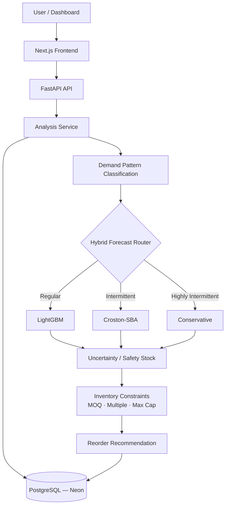
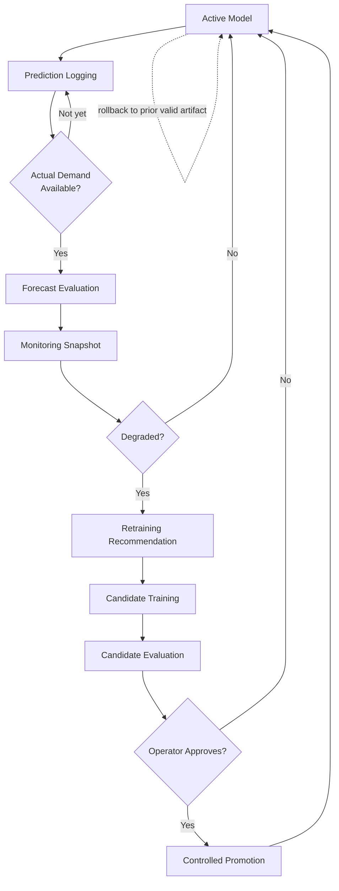
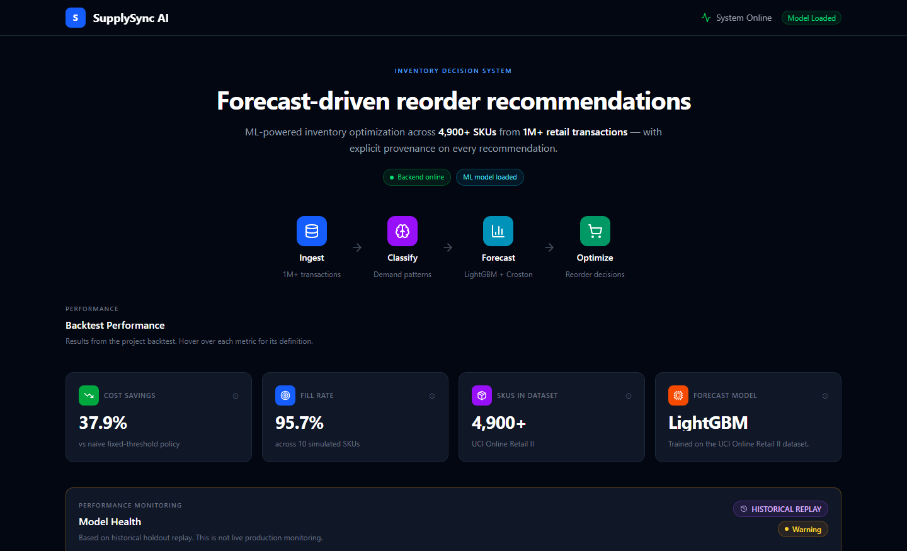
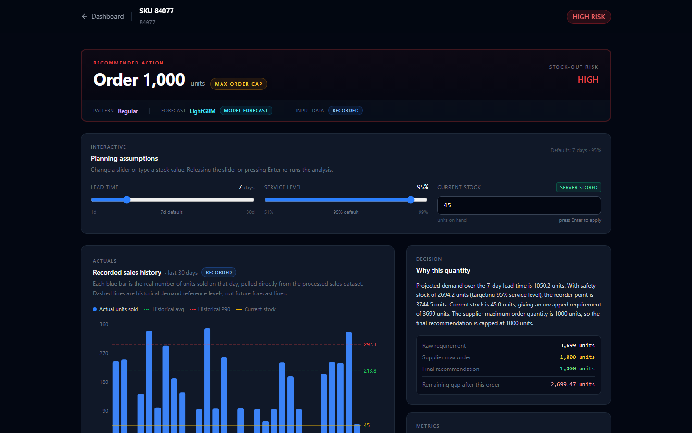
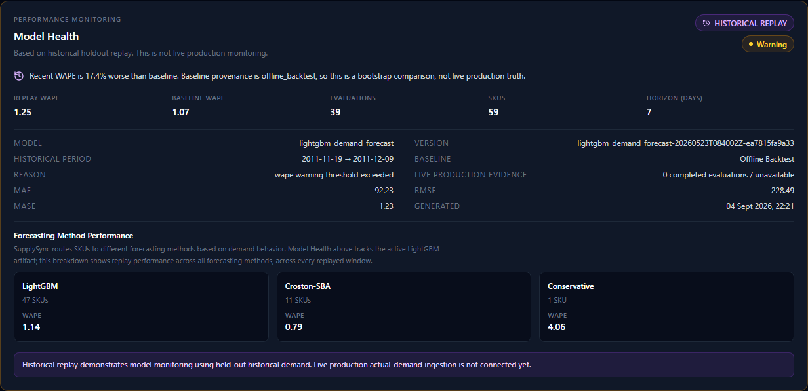
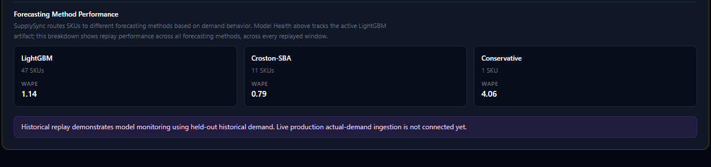

# SupplySync AI

[](https://github.com/Samarth7194/supplysync-ai/actions/workflows/test.yml)


**ML-powered inventory decision support with hybrid demand forecasting and a controlled MLOps lifecycle.**

SupplySync AI is a full-stack ML inventory decision-support prototype that classifies each SKU's demand pattern, routes it to an appropriate forecasting strategy (LightGBM, Croston-SBA, or a conservative buffer), quantifies forecast uncertainty, and converts the forecast into a constrained reorder recommendation. Beyond the forecast-to-decision path, it manages the model's own lifecycle — logging predictions, evaluating them once real outcomes exist, monitoring for performance degradation, recommending retraining, training and evaluating candidate models, and promoting or rolling back the serving artifact under explicit human control.

The deployed demo runs on a historical retail transaction dataset — there is no live ERP/POS feed. That constraint is treated as a design input rather than hidden: see [Model Monitoring & Historical Replay](#model-monitoring--historical-replay) for how the project still demonstrates a real monitoring lifecycle without fabricating data.

**Docs:** [Architecture](docs/architecture.md) · [Database Design](docs/database-design.md) · [MLOps Monitoring](docs/mlops-monitoring.md) · [MLOps Operations](docs/mlops-operations.md) · [Model Promotion](docs/model-promotion.md) · [API Reference](docs/api.md) · [Guided Tour](docs/PROJECT_GUIDED_TOUR.md) · [Project Explained](docs/PROJECT_EXPLAINED.md)

**Portfolio:** [Resume Entry](docs/portfolio/RESUME_PROJECT_ENTRY.md) · [Interview Guide](docs/portfolio/INTERVIEW_GUIDE.md) · [Project Summary](docs/portfolio/PROJECT_SUMMARY.md)

---

## Highlights

- **~4,900 SKUs**, **531K+ daily-demand records** (2009-12-01 → 2011-12-09) in the UCI Online Retail II dataset — the live demo serves the top 20 by volume, not the whole dataset
- **Evidence-based hybrid routing** — a multi-step, rolling-origin backtest (not a one-step-ahead evaluation) decides per demand class whether LightGBM, Croston-SBA, or a conservative buffer actually wins; a method is only routed to if it beats every reference baseline, not just the legacy default. With the currently-committed evidence this routes regular-demand SKUs to **Croston-SBA**, not LightGBM — see [What I Found and Changed](#what-i-found-and-changed)
- **Uncertainty-aware safety stock** — rolling residual sigma when evidence exists, Z-score × σ × √lead-time otherwise
- **Controlled MLOps lifecycle** — prediction logging → evaluation → monitoring → degradation detection → retraining recommendation → candidate training/evaluation → human-approved promotion → rollback, with a full audit trail; promotion now requires a candidate to beat the strongest baseline, not just the currently-active artifact
- **Historical Monitoring Replay** — demonstrates the monitoring pipeline honestly against held-out historical data instead of fabricating live telemetry
- **374 backend tests** (pytest) + **38 frontend tests** (typecheck + lint clean) + PostgreSQL integration tests, all in CI
- **Deployed full-stack**: Next.js on Vercel, FastAPI on Render, PostgreSQL on Neon

---

## Production Deployment

| Surface | Provider | Notes |
|---|---|---|
| Frontend | Vercel | Next.js 16 App Router |
| Backend API | Render | https://supplysync-ai.onrender.com |
| Database | Neon PostgreSQL | Alembic-managed schema, single migration head |
| Model runtime | Resolved at startup | DB-active artifact → configured local artifact → statistical fallback (see [Model Promotion](docs/model-promotion.md)) |

Free-tier hosting may cold-start after inactivity. Runtime model/data artifacts (the trained `.pkl` and processed parquet) are intentionally not committed to Git — only portable metadata is.

---

## How It Works

1. Load the SKU's recorded demand history (or accept caller-supplied history, or fall back to a clearly-labeled synthetic series for unknown SKUs).
2. Classify the demand pattern — regular, intermittent, or highly intermittent — from its zero-demand share.
3. Route to the forecasting method suited to that pattern.
4. Produce a multi-day horizon forecast.
5. Estimate forecast uncertainty from rolling residuals (or a historical fallback).
6. Compute lead-time demand, safety stock, and the reorder point.
7. Apply supplier constraints — MOQ, order multiple, maximum order cap.
8. Persist the recommendation and a linked prediction-log row as evaluation evidence.
9. Once a forecast's target window has actually passed, evaluate it against real recorded demand.
10. Roll evaluated forecasts into a monitoring snapshot that classifies recent performance as stable, warning, or degraded.

---

## Architecture


```mermaid
graph TD
    U[User / Dashboard] --> FE[Next.js Frontend]
    FE --> API[FastAPI API]
    API --> AS[Analysis Service]
    AS --> DC[Demand Pattern Classification]
    DC --> R{Hybrid Forecast Router}
    R -->|Regular| LGBM[LightGBM]
    R -->|Intermittent| CROS[Croston-SBA]
    R -->|Highly Intermittent| CONS[Conservative]
    LGBM --> UNC[Uncertainty / Safety Stock]
    CROS --> UNC
    CONS --> UNC
    UNC --> CON[Inventory Constraints<br/>MOQ · Multiple · Max Cap]
    CON --> REC[Reorder Recommendation]
    AS --> DB[(PostgreSQL — Neon)]
    REC --> DB
```

SKU history flows in from the processed dataset (or the caller), gets classified, routed to one of three forecasting methods, turned into an uncertainty-adjusted safety stock and reorder point, constrained by supplier rules, and returned alongside a persisted audit trail in PostgreSQL.

### Demand → forecast method

| Demand Pattern | Legacy Default | Why the default exists |
|---|---|---|
| Regular | **LightGBM** | Enough non-zero signal to learn lag/rolling/calendar relationships |
| Intermittent | **Croston-SBA** | Designed for sparse, non-zero demand; avoids the bias plain averaging introduces on gaps |
| Highly intermittent | **Conservative buffer** | Too little signal for ML to be trustworthy — a bounded buffer avoids overconfident forecasts |

These are the *legacy* per-pattern defaults, still used as the fallback when evidence is missing, stale, or too small a sample. With evidence-based routing (on by default), the router only switches away from a class's default when a method beats every reference baseline (predict-zero, 7-day moving average, seasonal-naive, Croston-SBA) in the backtest — not just the current default. With the evidence currently committed in this repo, that means **regular-demand SKUs actually route to Croston-SBA**, because LightGBM's own multi-step backtest WAPE (1.351) is worse than Croston-SBA's (0.444) — see [What I Found and Changed](#what-i-found-and-changed).

### From forecast to reorder decision

```
lead_time_demand = sum(forecast over lead time)
safety_stock     = Z(service_level) × forecast-error σ × √(lead time)      [or dynamic, from rolling residuals]
reorder_point    = lead_time_demand + safety_stock
raw_order        = max(0, reorder_point − current_stock)
final_order      = raw_order, rounded up to MOQ → order multiple → capped at max order
```

The system produces a **recommendation** — it does not place purchase orders automatically.

---

## Model Monitoring & Historical Replay

Live monitoring needs new predictions **and** the real demand that later arrives for them. The demo's dataset is historical and frozen at 2011-12-09, and the project has no live ERP/POS feed connected — so predictions logged against "today" target windows that extend past the dataset's end and can never receive genuine new actuals. Rather than fabricate demand to make the monitoring card look populated, live monitoring is left honestly `insufficient_evidence`/`unavailable` in that state, and a second mechanism — **Historical Monitoring Replay** — demonstrates the same monitoring lifecycle against data that already exists:

1. Pick an anchor date **T** inside the dataset, well before its end.
2. Forecast using only demand recorded on or before **T** (no future data enters feature generation — this is tested explicitly).
3. Compare that forecast against the real, already-recorded demand for **T+1 … T+H**.
4. Compute the same WAPE/MAE/RMSE/Bias/MASE metrics and the same stable/warning/degraded classification live monitoring uses.
5. Label every result `historical_replay` — never presented as live evidence, and structurally unable to trigger retraining, candidate training, or promotion.

The frontend shows this with a highly visible **HISTORICAL REPLAY** badge and the sentence *"This is not live production monitoring."*

**Most recent replay example** (`python scripts/run_historical_monitoring_replay.py`, reproducible without a live server or DB):

| | |
|---|---|
| Historical period | 2011-11-19 → 2011-12-09 |
| Horizon | 7 days |
| LightGBM-scoped evaluations (latest window) | 56 |
| Unique SKUs across replay | 60 |
| Replay WAPE | 1.576 |
| Offline-backtest baseline WAPE | 1.687 |
| Status | **Warning** — bias ratio 107.2%, above the configured warning threshold (WAPE itself is actually *better* than the offline baseline this window) |

| Method (all replayed windows) | SKUs | Evaluations | WAPE |
|---|---:|---:|---:|
| LightGBM | 56 | 167 | 1.430 |
| Conservative | 3 | 9 | 2.152 |
| Croston-SBA | 2 | 4 | 0.984 |

These three method rows come from **different SKU populations** selected by the router (regular vs. intermittent vs. highly-intermittent demand) — not a controlled head-to-head benchmark on the same SKUs. Replay is deliberately isolated from `ModelRoutingService` (see [docs/mlops-monitoring.md](docs/mlops-monitoring.md)), so it still routes regular-demand SKUs to LightGBM even though live evidence-based routing now sends them to Croston-SBA instead — the two are intentionally different evaluation surfaces, not a discrepancy to reconcile.

### Three evidence concepts — do not confuse them

| | Used for | Source |
|---|---|---|
| **Offline Backtest** | Model comparison, evidence-based routing | `scripts/evaluate_forecast.py`, multi-step rolling-origin (`src/evaluation/backtest.py`) |
| **Historical Monitoring Replay** | Demonstrating the monitoring lifecycle end-to-end | Held-out historical windows, described above |
| **Live Production Monitoring** | Real production forecast-performance tracking | Requires new predictions **and** subsequently-arriving real demand — not currently connected |

---

## MLOps Lifecycle


```mermaid
graph TD
    A[Active Model] --> B[Prediction Logging]
    B --> C{Actual Demand<br/>Available?}
    C -->|Not yet| B
    C -->|Yes| D[Forecast Evaluation]
    D --> E[Monitoring Snapshot]
    E --> F{Degraded?}
    F -->|No| A
    F -->|Yes| G[Retraining Recommendation]
    G --> H[Candidate Training]
    H --> I[Candidate Evaluation]
    I --> J{Operator Approves?}
    J -->|Yes| K[Controlled Promotion]
    J -->|No| A
    K --> A
    A -. rollback to prior valid artifact .-> A
```

**Implemented:** prediction logging, temporally-safe forecast evaluation (WAPE/MAE/RMSE/Bias/MASE), rolling monitoring snapshots, WAPE/bias degradation detection, retraining recommendations, candidate model training and evaluation, a checksum- and feature-schema-validated artifact registry, model lifecycle states, controlled promotion with an evidence gate, rollback to any prior valid artifact, a full promotion/rollback audit trail, DB-active runtime model resolution, and a safe operational cycle script that evaluates/monitors/recommends without ever training or promoting on its own.

**`AUTO_RETRAIN_ENABLED=false` and automatic promotion are both intentionally disabled.** The system can *recommend* retraining and can *evaluate* a candidate as promotion-eligible — it never trains or promotes anything by itself. A human runs the promotion or rollback CLI explicitly, and every such action is validated (checksum, feature schema, deserialization) before it changes the database's lifecycle state, and recorded to an audit table either way. See [docs/model-promotion.md](docs/model-promotion.md).

---

## Evaluation

**Offline backtest** (`scripts/evaluate_forecast.py`, multi-step rolling-origin, 200 SKUs, 4,800 forecast origins, H=7 days, all classes pooled — full per-class tables in [docs/forecast-evaluation.md](docs/forecast-evaluation.md)):

| Method | WAPE (lead-time sum) | Bias | MASE |
|---|---:|---:|---:|
| **production routed (today's live hybrid policy)** | **0.480** | −2% | 1.157 |
| Croston-SBA (strongest baseline) | 0.490 | −0% | 1.290 |
| 7-day moving average | 0.566 | +4% | 1.197 |
| seasonal naive (7) | 0.566 | +4% | 1.258 |
| predict zero | 1.000 | −100% | 1.171 |
| LightGBM (production artifact) | 1.560 | +138% | 3.567 |

Evidence-based routing now actually routes: production's own WAPE (0.480) is indistinguishable from Croston-SBA's (0.490), because regular-demand SKUs are routed to Croston-SBA and intermittent SKUs already default to it. LightGBM does not win any class, including the regular-demand one it's scoped to (0.444 for Croston-SBA vs. 1.351 for LightGBM at H=7 — see [docs/forecast-evaluation.md](docs/forecast-evaluation.md)). That's not hidden or tuned away: evidence-based routing reads this exact evidence and, per its own gate (a method is only selected if it beats every reference baseline, not just the legacy default), sends regular-demand SKUs to Croston-SBA instead of LightGBM. LightGBM candidates retrained with wider data and SKU-profile features close most of the gap (WAPE 0.489 with a tweedie objective) but still don't beat Croston-SBA on this class — see [docs/model-candidates-comparison.md](docs/model-candidates-comparison.md). No single method dominates every demand pattern on real retail data, so the system doesn't pretend one does — it evaluates evidence per pattern and routes accordingly, even when the result isn't flattering to the ML path.

This is the *held-out* backtest window — evaluated exactly once, after method selection (Croston-SBA for regular/intermittent, a bare-mean conservative buffer for highly-intermittent — see [What I Found and Changed](#what-i-found-and-changed)) was decided on a separate, earlier validation window. Nothing here was tuned by looking at these specific numbers first.

**Historical Monitoring Replay** (7-day horizon, held-out historical windows) is summarized above — it exercises the live routing/forecasting code against already-recorded history, which is a different evaluation surface than the offline backtest above, so its numbers are not directly comparable even though both report WAPE.

Reproduce the offline backtest:
```bash
cd backend && python scripts/evaluate_forecast.py --horizons 7,14 --max-skus 200
```

---

## Screenshots

Real captures from the deployed app (Vercel frontend + Render backend), not mockups.

### Dashboard


### SKU Decision Analysis


### Model Monitoring — Historical Replay


### Hybrid Forecasting Method Performance


---

## Repository Structure

```
backend/
  src/         # services, repositories, forecasting, inventory, evaluation, MLOps logic
  scripts/     # operator CLIs — train, evaluate, promote, rollback, monitor, replay
  tests/       # 360+ pytest cases
  data/        # cached KPIs, offline evaluation artifacts, historical replay output
frontend/
  app/         # Next.js App Router pages
  components/  # dashboard + Model Health / Historical Replay UI
  lib/         # typed API client, formatting helpers
  tests/       # node test runner + typecheck + lint
docs/
  architecture.md, database-design.md, mlops-monitoring.md,
  mlops-operations.md, model-promotion.md, api.md, portfolio/
```

---

## Local Setup

### Prerequisites
- Python 3.11+ (CI runs 3.12)
- Node.js 20+
- ~500 MB disk for the raw CSV + processed parquet + trained model

### 1. Get the dataset
Download `online_retail_II.csv` from [UCI](https://archive.ics.uci.edu/dataset/502/online+retail+ii) and place it at `data/raw/online_retail_II.csv` (not committed to the repo).

### 2. Backend
```bash
cd backend
python -m venv .venv && source .venv/bin/activate   # Windows: .venv\Scripts\activate
pip install -r requirements.txt

python scripts/check_setup.py     # shows what's present vs. missing
python scripts/bootstrap.py       # trains LightGBM, builds the parquet, computes KPIs (idempotent)

python -m alembic upgrade head    # applies the PostgreSQL schema (safe on SQLite too, for local dev)
python -m pytest tests/ -q        # 374 passed, 8 skipped

uvicorn main:app --reload --port 8000
```

### 3. Frontend
```bash
cd frontend
npm install
cp .env.example .env.local   # set NEXT_PUBLIC_API_URL if not http://localhost:8000
npm run dev                  # http://localhost:3000
```

### Docker (optional)
```bash
cd backend && python scripts/bootstrap.py && cd ..   # generate artifacts on the host first
docker-compose up --build
```

---

## Environment Variables

**Backend** (see `backend/.env.example` for the full list):

| Variable | Default | Purpose |
|---|---|---|
| `DATABASE_URL` | `sqlite:///backend/data/supplysync.db` | SQLAlchemy database URL — use PostgreSQL in Docker/production |
| `MODEL_PATH` | `backend/saved_models` | Where the LightGBM artifact is loaded/saved from |
| `AUTH_MODE` | `off` | `off` (open API) or `demo` (session-cookie login) |
| `SESSION_SECRET` | *(ephemeral per-process)* | HMAC key for signing demo-auth session cookies |
| `AUTO_RETRAIN_ENABLED` | `false` | Kept `false` — retraining can be *recommended*, never auto-executed |
| `ALLOWED_ORIGINS` | `http://localhost:3000` | Comma-separated CORS origins |

Never commit real values for `SESSION_SECRET`, `DATABASE_URL`, or `API_KEY` — copy `.env.example` to `.env` and fill in locally.

**Frontend** (`frontend/.env.example`):

| Variable | Default | Purpose |
|---|---|---|
| `NEXT_PUBLIC_API_URL` | `http://localhost:8000` | Backend base URL |

---

## Testing & Quality

| Check | Command | Result |
|---|---|---|
| Backend tests | `cd backend && python -m pytest tests/ -q` | 374 passed, 8 skipped |
| Frontend tests | `cd frontend && npm test` | 38 passed, typecheck clean, lint clean |
| Frontend build | `cd frontend && npm run build` | Passes |
| Alembic | `cd backend && python -m alembic heads` | Single head |
| CI | [`.github/workflows/test.yml`](.github/workflows/test.yml) | backend-tests, frontend-checks, postgres-integration on every push/PR to `main` |

CI additionally validates the full Alembic migration chain (`upgrade head` → `downgrade` → `upgrade head`) against a real PostgreSQL service container, not just SQLite.

---

## Current Limitations

- The demo dataset is historical and frozen (2009-12-01 → 2011-12-09); there is no live ERP/POS integration.
- Live production monitoring cannot accumulate genuinely new evidence without a live actual-demand feed — see [Historical Monitoring Replay](#model-monitoring--historical-replay) for how the project demonstrates the pipeline anyway, and note that replay is explicitly not live evidence.
- **The KPI simulation's aggregate cost is close to break-even (-1.7% vs. naive) but its mean per-SKU savings figure is clearly negative (-30.5%, 95% CI [-46.5%, -14.4%])** — see [What I Found and Changed](#what-i-found-and-changed) point 12. This is the real output of `scripts/compute_kpis.py`, kept as computed rather than tuned to look better, and the aggregate/per-SKU divergence itself is unexplained and worth investigating further.
- LightGBM does not win the backtest on the regular-demand class it's scoped to; evidence-based routing now sends that class to Croston-SBA instead (see [Evaluation](#evaluation)).
- Monitoring detects forecast-performance degradation (WAPE/bias drift); it does not perform feature- or input-distribution drift detection.
- Automatic retraining and automatic promotion are both intentionally disabled — every model lifecycle change requires an explicit operator command.
- The production deployment assumes a single backend worker; multi-worker runtime synchronization after a promotion is not implemented (a restart/redeploy is required to pick up a newly-promoted artifact).

## Future Work

- Incremental/live demand ingestion from a real ERP or POS system.
- A proper connector layer instead of the current CSV/parquet pipeline.
- Close the remaining regular-demand gap: even the best retrained LightGBM candidate (tweedie objective, wider training data, SKU-profile features) doesn't beat Croston-SBA on that class yet — see [docs/model-candidates-comparison.md](docs/model-candidates-comparison.md).
- Investigate why the KPI simulation's mean per-SKU savings (-30.5%) and aggregate savings (-1.7%) diverge so sharply — likely driven by a handful of low-cost SKUs swinging heavily negative in percentage terms, but not yet confirmed per-SKU.
- Understand why several small/highly-intermittent SKUs hit 100% fill rate at *higher* cost than the naive policy after wiring in the residual-sigma safety stock — investigate whether that safety stock is now systematically oversized for very sparse demand.
- Feature- and input-distribution drift detection alongside the existing performance monitoring.
- Probabilistic forecasting (quantile regression or conformal intervals) beyond the current residual-based uncertainty approximation.
- Distributed/multi-worker model synchronization after promotion.
- Broader offline benchmarking against additional model families.

---

## What I Found and Changed

This project went through an internal audit that found the original evaluation, forecasting, and simulation code were each quietly flattering the system. Nothing here was hidden after the fact — the fixes and the resulting (sometimes unflattering) numbers are all in the commit history on this branch.

1. **The original evaluation methodology was one-step-ahead with actuals fed back**, not a real multi-day forecast test — it measured "can the model predict tomorrow given today's true value," while the app's own reorder logic consumes a whole lead-time horizon forecast. Replaced with a shared, rolling-origin, multi-step backtest (`src/evaluation/backtest.py`) that calls the exact same production forecast path, used by evaluation scripts, monitoring, candidate promotion, and routing alike — one methodology, not three copy-pasted ones.
2. **The recursive LightGBM forecast had a real bug**: each step forward mutated a single static feature row instead of rebuilding lag/rolling/calendar features from the extended series, so calendar features froze and `rolling_std` collapsed to zero after one step. Fixed by rebuilding every feature at each recursive step. Before/after on the corrected backtest (H=7, lead-time-sum WAPE): regular 3.736 → 1.351, intermittent 11.478 → 4.627, highly-intermittent 11.500 → 7.374 — a large improvement, but not enough to make LightGBM competitive on the regular class (see next point).
3. **Once evaluation and recursion were both honest, LightGBM turned out not to win** on the demand class it's actually scoped to: Croston-SBA beats it by a wide margin (0.444 vs. 1.351 WAPE at H=7) on regular-demand SKUs, even after retraining LightGBM on 2,545 SKUs with SKU-profile features and a tweedie objective (best result: 0.489, still short of Croston-SBA). This is reported, not hidden — see [docs/model-candidates-comparison.md](docs/model-candidates-comparison.md).
4. **Evidence-based routing was rebuilt to consume that corrected evidence** and to require a method to beat every reference baseline (not just the legacy per-pattern default) before it's selected — and turned on by default. The direct consequence: regular-demand SKUs now route to Croston-SBA in production, not LightGBM.
5. **The promotion gate had the same blind spot**: a candidate only had to beat the currently-active artifact, not the best available method. It now must beat the strongest baseline too.
6. **`p50`/`p90` were never true forecast percentiles** — they were a 60-day historical mean and a 60-day historical 90th-percentile, labeled like model output. Renamed to `historical_mean_60d`/`historical_p90_60d` throughout the API, database, and UI (old names kept for one release as deprecated aliases). Risk is now classified directly from the decision (HIGH if stock < lead-time demand, MEDIUM if < reorder point, LOW otherwise), with a test asserting a LOW-risk SKU can never receive a nonzero reorder.
7. **The KPI/ROI simulation was running against `IntelligentInventoryService(model=None)`** — it silently fell back to a moving average for every SKU instead of loading the trained model, tracked on-hand inventory only (ignoring stock already on order, so policies over-ordered), had no warm-up period, and only simulated 10 SKUs against a single weak baseline. Fixed: the real model and evidence-based routing are now wired in, policies decide off inventory *position* (on-hand + on-order), a 14-day warm-up period is excluded from every metric, 50 SKUs are simulated over 90 measured days against two baselines (naive fixed-threshold and a new moving-average reorder-point policy), and sensitivity to the stockout:holding cost ratio is reported. **The honest result is worse, not better** — see point 12 below for the final numbers after the fixes in points 9-11, which changed this figure twice more.
8. **The dashboard hero claimed "4,900+ SKUs"** as if the live app optimized across the whole dataset; it only ever served the top 20. Now states the demo/dataset split honestly. Demo stock levels were a plain `index % 3` multiplier that almost never produced a healthy (no-action) SKU; now seeded from an approximation of each SKU's own reorder point so some SKUs correctly show no action needed. Product names now come from a small committed file so they don't silently degrade to "SKU {code}" when the raw CSV isn't present. Repeated identical dashboard reads within 15 minutes no longer each write a fresh `analysis_runs`/`prediction_logs` row.
9. **The backtest's own "production routed" measurement never actually called the routing service.** `scripts/evaluate_forecast.py` built that forecaster without passing `routing_service`, so every "production routed" row in every table above (before this fix) was silently the legacy per-pattern default relabeled — not a measurement of what `/api/analyze` actually does. The live app's routing was already correct; the backtest's *reporting* of it was not. Verified directly against `ModelRoutingService.select_method()`: it already picks Croston for regular demand (67-81% WAPE improvement, clears every gate) — the bug was purely a missing constructor argument. Fixed by wiring in the same construction `AnalysisService`/`compute_kpis.py` already use. Real effect on the backtest table: production-routed WAPE (lead-time sum, H=7, all classes) goes from 1.347 to 0.480 — not because live production changed, but because the number now actually reflects it.
10. **Highly-intermittent demand was being evaluated, and its buffer tuned, by WAPE** — a metric where predict-zero always "wins" (1.000, since that class is mostly zeros) regardless of whether a policy actually places a good order. Selected by simulated inventory cost instead (`scripts/evaluate_highly_intermittent_policy.py`, on a separate validation window, never the held-out one): a plain-mean forecast with **no buffer** beat the previous 1.5x buffer, a 2x buffer, Croston-SBA, and a 7-day average at every tested stockout:holding ratio (2:1 through 20:1) — 18-22% cheaper than the 1.5x default, which turned out to be actively wasteful once safety stock (a separate mechanism) was already covering the volatility the buffer was meant to hedge. Changed the default from 1.5 to 1.0.
11. **Safety stock used historical demand volatility even when the actual forecast error of the method being used was available and more relevant.** Added an offline-backtest-derived residual sigma (reusing sums already computed for bias/RMSE in the shared backtest — no separate evaluation pass) as a fallback tier ahead of historical std, in both `/api/analyze` and the KPI simulator; exposed via `decision.uncertainty.source` (new value: `offline_pattern_residuals`).
12. **Held-out numbers, evaluated exactly once, after all of the above:** aggregate KPI cost went from -9.0% (before points 9-11) to **-1.7% vs. the naive baseline** — evidence-based routing and the cheaper highly-intermittent buffer both help in dollar terms, and fill rate improved from 86.8% to 90.5%. But the **mean per-SKU savings figure got worse, not better: -30.5% (95% CI [-46.5%, -14.4%], no longer crossing zero)** — a few small-cost SKUs (regular fixed-threshold cost in the thousands, not the tens of thousands) now swing heavily negative in percentage terms even though their dollar impact on the aggregate is small, which is exactly why the aggregate and mean-per-SKU numbers diverge instead of moving together. This is reported as found, not reconciled or tuned away — see [Current Limitations](#current-limitations).

---

## License

MIT
